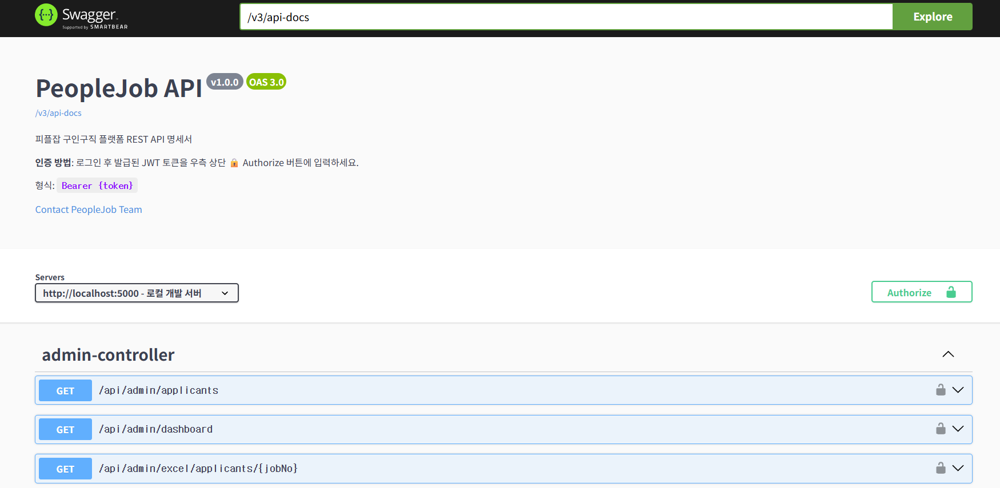

# PeopleJob Backend

> 구인구직 플랫폼 **피플잡**의 REST API 백엔드 서버

---

## 목차

1. [프로젝트 개요](#프로젝트-개요)
2. [기술 스택](#기술-스택)
3. [아키텍처](#아키텍처)
4. [패키지 구조](#패키지-구조)
5. [주요 도메인 및 API](#주요-도메인-및-api)
6. [환경 변수](#환경-변수)
7. [프로파일 전략](#프로파일-전략)
8. [캐시 전략](#캐시-전략)
9. [스케줄러](#스케줄러)
10. [부하 테스트 & 성능 측정](#부하-테스트--성능-측정)
11. [성능 개선 작업 기록](#성능-개선-작업-기록)
12. [트러블슈팅](#트러블슈팅)
13. [모니터링](#모니터링)
14. [로컬 개발 실행](#로컬-개발-실행)
15. [API 문서 (Swagger)](#api-문서-swagger)

---

## 프로젝트 개요

피플잡은 구직자와 기업을 연결하는 구인구직 플랫폼입니다.  
본 저장소는 Flutter 프론트엔드와 통신하는 **Spring Boot REST API 서버**입니다.

| 항목 | 내용 |
|------|------|
| 언어 | Java 17 |
| 프레임워크 | Spring Boot 3.4.4 |
| 빌드 도구 | Maven (mvnw) |
| 데이터베이스 | MySQL 8.x |
| 캐시 | Redis (운영) / ConcurrentMapCache (개발·테스트) |
| 인증 | JWT Bearer Token |
| 개발 포트 | **8090** |

---

## 기술 스택

| 분류 | 라이브러리 |
|------|-----------|
| Web | Spring Boot Starter Web |
| ORM | Spring Data JPA (Hibernate) + MyBatis |
| 보안 | Spring Security, JJWT 0.12.6 |
| 캐시 | Spring Cache + Spring Data Redis (Lettuce) |
| 이메일 | Spring Boot Mail + Thymeleaf 템플릿 |
| 파일 | Apache Commons IO, Apache POI (엑셀) |
| API 문서 | SpringDoc OpenAPI 2.6.0 (Swagger UI) |
| 모니터링 | Spring Actuator + Micrometer Prometheus |
| 검증 | Spring Boot Validation (Bean Validation) |
| 유틸 | Lombok, Jackson JSR310 |
| 테스트 | JUnit 5, Spring Security Test, H2 in-memory |
| 커버리지 | JaCoCo (최소 50% instruction coverage) |

---

## 아키텍처

```
Flutter 앱
    │  HTTP / JWT Bearer Token
    ▼
┌──────────────────────────────────────────────────────────┐
│                  Spring Boot (포트 8090)                  │
│                                                          │
│  JwtAuthenticationFilter                                 │
│         │                                                │
│  Controller ──► Service ──► Repository ──► MySQL         │
│                    │                                     │
│               @Cacheable/@CacheEvict                     │
│                    │                                     │
│                 Redis ◄── RedisConfig (prod only)        │
│                    │                                     │
│          CacheService / TokenCacheService                │
│          SessionService / RateLimitService               │
│          RedisScheduledTasks (prod only)                 │
│                                                          │
│  JobScheduler (자동 마감 / 광고 만료)                      │
│  Spring Actuator + Prometheus                            │
└──────────────────────────────────────────────────────────┘
```

- **Controller** : HTTP 요청 수신 및 응답 포맷팅
- **Service** : 비즈니스 로직, `@Cacheable` / `@CacheEvict` 어노테이션
- **Repository** : Spring Data JPA + JPQL 쿼리, MyBatis 매퍼 병행
- **Entity** : 소프트 삭제(`isActive`), 상태 Enum, `LocalDateTime` 감사 필드
- **Scheduler** : 자정 자동 마감, Redis 헬스체크, 토큰 정리

---

## 패키지 구조

```
src/main/java/com/people/job/
├── admin/          # 관리자 대시보드, 엑셀 다운로드, AOP 권한 체크
├── apply/          # 지원 관리 (구직자 → 채용공고 지원)
├── board/          # 자유 게시판
├── cache/          # CacheService (Redis 래퍼, @ConditionalOnProperty)
├── common/         # ApiResponse 공통 래퍼, RootController
├── config/         # Redis, CORS, Async, Email, Scheduling, Swagger, Security 설정
├── email/          # 이메일 발송 (인증메일, 비밀번호 재설정)
├── file/           # 파일 업로드/다운로드
├── health/         # Redis 커스텀 HealthIndicator
├── inquiry/        # 1:1 문의
├── job/            # 채용공고 (핵심 도메인)
│   ├── controller/ #   REST API
│   ├── dto/        #   요청/응답 DTO
│   ├── entity/     #   JobopeningEntity (상태 Enum)
│   ├── repository/ #   JPQL + FULLTEXT 검색 쿼리
│   ├── scheduler/  #   JobScheduler (자동 마감, 광고 만료)
│   └── service/    #   비즈니스 로직 + 캐시
├── mypage/         # 마이페이지 (프로필, 통계)
├── notice/         # 공지사항
├── notification/   # 알림 (Spring ApplicationEvent 기반)
├── payment/        # 결제 (광고 상품)
├── ratelimit/      # Rate Limit (Redis 슬라이딩 윈도우)
├── resume/         # 이력서
├── scrap/          # 채용공고 스크랩
├── scheduler/      # RedisScheduledTasks (Redis 환경 전용)
├── session/        # SessionService
├── token/          # TokenCacheService (로그아웃 토큰 블랙리스트)
└── user/           # 회원 (일반/기업), JWT, Spring Security

src/main/resources/
├── application.yml           # 공통 + 프로파일별 설정
├── application-dev.properties # 로컬 개발 오버라이드
├── mybatis/mapper/           # MyBatis XML 매퍼
├── templates/                # Thymeleaf 이메일 템플릿
└── static/assets/
    └── image.png             # Swagger UI 스크린샷
```

---

## 주요 도메인 및 API

### 채용공고 `/api/jobs`

| Method | Endpoint | 설명 |
|--------|----------|------|
| GET | `/api/jobs` | 목록 조회 (페이징, status 파라미터) |
| GET | `/api/jobs/{jobNo}` | 상세 조회 + 조회수 +1 |
| POST | `/api/jobs` | 채용공고 생성 (DRAFT 상태) |
| PUT | `/api/jobs/{jobNo}` | 수정 |
| DELETE | `/api/jobs/{jobNo}` | 소프트 삭제 (isActive=false) |
| POST | `/api/jobs/draft` | 임시저장 |
| POST | `/api/jobs/{jobNo}/publish` | 게시 (DRAFT → PUBLISHED) |
| PUT | `/api/jobs/{jobNo}/status` | 상태 변경 |
| GET | `/api/jobs/search` | 키워드 검색 (FULLTEXT → LIKE 폴백) |
| GET | `/api/jobs/category` | 직종·지역 복합 필터 |
| GET | `/api/jobs/user/{userNo}` | 사용자별 목록 |
| GET | `/api/jobs/user/{userNo}/drafts` | 임시저장 목록 |
| GET | `/api/jobs/user/{userNo}/status-counts` | 상태별 개수 |
| POST | `/api/jobs/expire-overdue` | 만료 공고 일괄 처리 |

**채용공고 상태 흐름:**

```
DRAFT ──publish──► PUBLISHED ──deadline 초과──► EXPIRED
                       │
                   suspend (관리자)
                       ▼
                   SUSPENDED
```

### 회원 `/api/user`, `/api/auth`

JWT 토큰 발급, 회원 CRUD, 이메일 인증, 비밀번호 재설정.

### 이력서 `/api/resume`

구직자 이력서 등록·수정·삭제, 기업 인재검색.

### 지원 `/api/apply`

구직자 지원, 기업 지원자 목록 및 상태 관리.

### 관리자 `/api/admin`

| Endpoint | 설명 |
|----------|------|
| `/api/admin/dashboard` | 전체 통계 조회 |
| `/api/admin/applicants` | 지원자 전체 목록 |
| `/api/admin/excel/applicants/{jobNo}` | 지원자 엑셀 다운로드 (Apache POI) |

기타: 게시판(`/api/board`), 공지(`/api/notice`), 문의(`/api/inquiry`),  
결제(`/api/payment`), 스크랩(`/api/scrap`), 파일(`/api/files`), 이메일(`/api/email`)

---

## 환경 변수

`.env` 파일로 환경변수를 관리합니다. (API URL, Firebase, DB 접속 정보 등)

---

## 프로파일 전략

| 프로파일 | 실행 방법 | 캐시 | DB | 용도 |
|---------|----------|------|-----|------|
| `dev` | `.\run-dev.ps1` | `simple` (in-memory) | MySQL (포트 3307) | 로컬 개발 |
| `prod` | JAR + env | `redis` | MySQL | 운영 배포 |
| `test` | Maven test | `simple` | H2 in-memory | 자동화 테스트 |

**Redis 조건부 활성화**  
`spring.cache.type=redis`일 때만 `@ConditionalOnProperty`로 Redis 관련 빈이 등록됩니다.  
개발 환경에서 Redis 없이도 정상 기동되며, Spring Boot가 `ConcurrentMapCacheManager`를 자동 구성합니다.

대상 클래스: `RedisConfig`, `CacheService`, `RateLimitService`, `SessionService`, `TokenCacheService`, `RedisScheduledTasks`

---

## 캐시 전략

### Redis 캐시 (운영)

| 캐시 이름 | 키 | TTL | 무효화 조건 |
|----------|-----|-----|------------|
| `publishedJobs` | `pageNumber-pageSize` | 10분 | 채용공고 생성/수정/삭제/게시/만료 시 전체 evict |
| `jobSearch` | `keyword-pageNumber-pageSize` | 10분 | 별도 evict 없음 (TTL 만료로 자연 소멸) |

```java
@Cacheable(value = "publishedJobs", key = "#pageable.pageNumber + '-' + #pageable.pageSize")
public Page<JobopeningDTO> getPublishedJobs(Pageable pageable) { ... }

@CacheEvict(value = "publishedJobs", allEntries = true)
public JobopeningDTO create(JobopeningDTO dto) { ... }

@Cacheable(value = "jobSearch", key = "#keyword + '-' + #pageable.pageNumber + '-' + #pageable.pageSize")
public Page<JobopeningDTO> searchJobs(String keyword, Pageable pageable) { ... }
```

### 캐시 에러 처리

`RedisConfig`가 `CachingConfigurer`를 구현하여 `SimpleCacheErrorHandler`를 등록합니다.  
Redis 장애 시 예외를 무시하고 DB에서 직접 조회하는 **캐시 미스 폴백**이 자동 동작합니다.

### HikariCP 커넥션 풀 (100 VU 기준 튜닝)

```yaml
hikari:
  maximum-pool-size: 50    # 100 VU 부하 대응 (기본값 10에서 증설)
  minimum-idle: 20
  connection-timeout: 30000  # 30초
  idle-timeout: 600000       # 10분
  max-lifetime: 1800000      # 30분
```

---

## 스케줄러

### JobScheduler

| 크론 | 동작 |
|------|------|
| `0 0 0 * * *` (자정) | 마감일 지난 공고 `PUBLISHED → EXPIRED` 자동 처리 |
| `0 0 * * * *` (매시간) | 마감일 지난 공고 추가 확인 |
| `0 0 * * * *` (매시간) | 광고 종료일(`adEndDate`) 지난 공고 광고 플래그 해제 |

### RedisScheduledTasks *(Redis 환경 전용)*

| 크론/주기 | 동작 |
|----------|------|
| `0 0 2 * * *` (새벽 2시) | 만료 토큰 정리 |
| 10분마다 | Redis 연결 헬스체크 |
| `0 0 * * * *` (매시간) | 캐시 통계 로깅 |

---

## 부하 테스트 & 성능 측정

### 도구: k6

[k6](https://k6.io/)는 Go 기반 오픈소스 부하테스트 도구입니다.  
JavaScript로 시나리오를 작성하고, `load-test/load_test.js`에 전체 구현이 있습니다.

### 사전 준비

```powershell
# 1. k6 설치
winget install k6

# 2. 백엔드 서버 실행
.\run-dev.ps1

# 3. (선택) 더미 데이터 10만 건 삽입 — seed_data.sql 실행
```

### 실행

```powershell
# 기본 실행 (터미널에 실시간 메트릭 출력)
k6 run load-test/load_test.js

# JSON 결과 저장
k6 run --out json=load-test/result.json load-test/load_test.js
```

---

### 부하 시나리오 — 단계별 VU 증가

```
 VU
100 │               ┌──────────┐
 50 │          ┌────┘          └──┐
 10 │     ┌───┘                   └─── 0
    └──────────────────────────────────► 시간
          30s   1m    30s   1m    30s
         워밍업 정상  피크  유지  쿨다운
```

| 단계 | 시간 | 동시 사용자 | 목적 |
|------|------|------------|------|
| 워밍업 | 30초 | 0 → 10 VU | JVM JIT 웜업, 커넥션 풀 초기화 |
| 정상 부하 | 1분 | 50 VU | 평시 트래픽 기준 측정 |
| 피크 증가 | 30초 | 50 → 100 VU | 순간 트래픽 급증 재현 |
| 피크 유지 | 1분 | 100 VU | 100 동시 사용자 내구성 검증 |
| 쿨다운 | 30초 | 100 → 0 VU | 정상 종료, 최종 메트릭 수집 |

---

### 테스트 시나리오 (3개 그룹)

각 VU는 시나리오 1 → 2 → 3 순서로 실행하며, 사이에 랜덤 슬립(0.5~2초)을 삽입해 실제 사용자 행동을 모사합니다.

#### 시나리오 1 — 채용공고 목록 조회 (캐시 효과 측정 핵심)

```js
group('채용공고 목록 조회', () => {
  const page = Math.floor(Math.random() * 3);
  const res = http.get(`${BASE_URL}/api/jobs?status=published&page=${page}&size=20`);

  jobListDuration.add(res.timings.duration);

  // 응답 시간 50ms 미만 → 캐시 히트로 추정
  if (res.timings.duration < 50) cacheHitCounter.add(1);
});
```

`status=published` 파라미터로 `@Cacheable(value = "publishedJobs")`가 적용된 엔드포인트를 호출합니다.  
동일 페이지를 다수의 VU가 동시에 요청할수록 캐시 히트율이 상승하고  
`job_list_duration p95`가 급감하는 것을 관측할 수 있습니다.

#### 시나리오 2 — 카테고리 필터 조회

```js
group('카테고리 필터', () => {
  const jobType  = randomItem(['IT개발', '영업', '마케팅', '디자인', '인사', '경영지원']);
  const location = randomItem(['서울', '부산', '대구', '인천', '광주', '대전']);
  const res = http.get(
    `${BASE_URL}/api/jobs/category?jobType=${encodeURIComponent(jobType)}&location=${encodeURIComponent(location)}&page=0&size=10`
  );
  check(res, { 'category 200': (r) => r.status === 200 });
});
```

직종·지역 복합 조건 쿼리의 처리량과 응답 시간을 측정합니다.  
파라미터 조합별 별도 쿼리 메서드(`OR :param IS NULL` 패턴 제거)의 효과를 검증합니다.

#### 시나리오 3 — 채용공고 상세 조회 (쓰기 트랜잭션 포함)

```js
group('채용공고 상세 조회', () => {
  const jobNo = randomItem(jobIds);  // setup()에서 수집한 실제 jobNo 사용
  const res = http.get(`${BASE_URL}/api/jobs/${jobNo}`);
  jobDetailDuration.add(res.timings.duration);
  check(res, { 'detail 200': (r) => r.status === 200 });
});
```

조회수 +1이 포함된 `@Transactional` 엔드포인트의 처리량을 검증합니다.  
`@Transactional(readOnly = true)`로 선언하면 쓰기가 막히므로 의도적으로 일반 트랜잭션으로 처리합니다.

---

### SLO (Service Level Objective) — 임계값 설정

```js
thresholds: {
  'http_req_failed':     ['rate<0.01'],    // 전체 에러율 < 1%
  'job_list_duration':   ['p(95)<3000'],   // 목록 조회 p95 < 3s (캐시 워밍업 포함)
  'job_detail_duration': ['p(99)<3000'],   // 상세 조회 p99 < 3s (100 VU viewCount 경합 포함)
}
```

임계값 초과 시 k6가 비제로 종료 코드를 반환합니다.  
CI 파이프라인에 연결하면 SLO를 만족하지 못하는 배포를 자동으로 차단할 수 있습니다.

---

### 커스텀 메트릭

| 메트릭 이름 | 타입 | 설명 |
|------------|------|------|
| `job_list_duration` | Trend | 목록 조회 응답 시간 (ms), percentile 출력 |
| `job_detail_duration` | Trend | 상세 조회 응답 시간 (ms), percentile 출력 |
| `error_rate` | Rate | 비정상 응답 비율 |
| `cache_hit_count` | Counter | 캐시 히트 추정 횟수 (응답 50ms 미만) |

### 테스트 종료 후 자동 요약 출력

`handleSummary()` 함수가 테스트 완료 시 콘솔에 출력하고  
`load-test/result_summary.json`에 타임스탬프와 함께 저장합니다.

```
====== 부하테스트 결과 요약 ======
  총 요청 수:          11,848
  에러율 (%):          0.00
  전체 응답 p95 (ms):  157
  목록 조회 p95 (ms):  103    ← @Cacheable 캐시 히트 효과
  상세 조회 p99 (ms):  0      ← PK 조회 < 1ms (sub-ms 반올림)
  캐시 히트 추정:       3,502
==================================
```

---

## 성능 개선 작업 기록

k6 부하테스트를 반복 실행하며 발견한 병목을 순차적으로 제거한 과정입니다.

### 최종 결과 비교

| 메트릭 | 초기 실행 | 최종 실행 | 개선율 |
|--------|----------|---------|-------|
| 총 요청 수 | 2,222 | 11,848 | +433% |
| 에러율 | 0.07% | 0.00% | ✓ |
| 전체 응답 p95 | - | 157ms | - |
| 목록 조회 p95 | 13,888ms | 103ms | **-99.3%** |
| 캐시 히트 추정 | 0 | 3,502 | - |

---

### 개선 1 — 잘못된 엔드포인트 사용 수정 (가장 큰 효과)

**변경 전:** k6가 `GET /api/jobs` 호출 → `getAll()` 메서드 → `@Cacheable` 없음 → 매 요청마다 전체 테이블 스캔  
**변경 후:** `GET /api/jobs?status=published` → `getPublishedJobs()` 메서드 → `@Cacheable(value = "publishedJobs")` 히트

```js
// 수정 전
http.get(`${BASE_URL}/api/jobs?page=${page}&size=20`)

// 수정 후 — 캐시가 걸린 엔드포인트를 명시적으로 지정
http.get(`${BASE_URL}/api/jobs?status=published&page=${page}&size=20`)
```

이 한 줄 변경만으로 목록 조회 p95가 **13,888ms → 103ms**로 감소했습니다.

---

### 개선 2 — 커버링 인덱스 추가 (`load-test/add_indexes.sql`)

`findPublishedJobs` 쿼리는 `WHERE status, isActive` 조건 후 `ORDER BY isAdvertised DESC, regdate DESC`로 정렬합니다.  
ORDER BY 컬럼이 인덱스에 포함되지 않으면 filesort가 발생합니다.

```sql
ALTER TABLE jobopening
  ADD INDEX idx_job_list (status, isActive, isAdvertised, regdate);
```

ORDER BY에 사용되는 컬럼까지 인덱스에 포함시켜 filesort를 제거했습니다.

---

### 개선 3 — 카테고리 쿼리 분리 (OR NULL 패턴 제거)

**문제:** `OR :param IS NULL` 조건은 MySQL 옵티마이저가 인덱스를 사용하지 못하게 합니다.

```sql
-- 수정 전 (인덱스 미사용)
WHERE (:jobType IS NULL OR jobType = :jobType)
  AND (:location IS NULL OR location = :location)
```

**해결:** 파라미터 조합별로 별도 쿼리 메서드 3개로 분리하고, 서비스 레이어에서 분기 처리합니다.

```java
// JobopeningRepository — 3개 메서드로 분리
Page<JobopeningEntity> findPublishedJobsByCategory(status, jobType, location, pageable);
Page<JobopeningEntity> findPublishedJobsByJobType(status, jobType, pageable);
Page<JobopeningEntity> findPublishedJobsByLocation(status, location, pageable);
```

---

### 개선 4 — FULLTEXT 인덱스 ngram 파서 적용

기본 파서는 한국어 단어를 토큰화하지 못해 FULLTEXT 검색이 예외를 발생시키고 LIKE 폴백으로 넘어갔습니다.

```sql
-- ngram 파서로 재생성
ALTER TABLE jobopening
  ADD FULLTEXT INDEX ft_job_search (title, content, company) WITH PARSER ngram;
```

한국어 단어를 2-gram 단위로 인덱싱하여 FULLTEXT 검색이 정상 동작하도록 수정했습니다.

---

### 개선 5 — HikariCP 커넥션 풀 증설

100 VU 동시 요청 시 커넥션 대기가 발생했습니다.

```yaml
# application.yml
spring.datasource.hikari:
  maximum-pool-size: 50   # 기본값 10 → 50
  minimum-idle: 20
```

---

### 개선 6 — 검색 결과 캐싱 추가

```java
@Cacheable(value = "jobSearch",
           key = "#keyword + '-' + #pageable.pageNumber + '-' + #pageable.pageSize")
public Page<JobopeningDTO> searchJobs(String keyword, Pageable pageable)
```

동일 키워드 반복 요청에 대해 DB 쿼리 없이 캐시에서 응답합니다.

---

## 트러블슈팅

### 이슈 1 — 목록 조회 p95 13,888ms (캐시가 전혀 동작하지 않음)

**증상:** 부하테스트 첫 실행에서 목록 조회 p95가 13초를 넘음. 캐시 히트 추정이 0.  
**원인:** k6 시나리오가 `GET /api/jobs`를 호출하고 있었는데, 이 경로는 `getAll()` (관리자용 전체 조회) 메서드로 라우팅됨. `getAll()`에는 `@Cacheable`이 없어 100 VU 전원이 매 요청마다 DB 풀스캔.  
**해결:** 쿼리스트링에 `status=published`를 추가해 `getPublishedJobs()`로 라우팅되도록 수정. 이 메서드에는 `@Cacheable(value = "publishedJobs")`가 적용되어 있어 두 번째 요청부터 캐시 히트.

---

### 이슈 2 — 검색 p95 18,612ms (FULLTEXT가 동작하지 않음)

**증상:** 검색 시나리오에서 응답 시간이 18초 이상.  
**원인:** DBeaver에서 `ft_job_search` FULLTEXT 인덱스가 보였으나 ngram 파서 없이 생성된 상태. 한국어 단어는 기본 파서로 토큰화되지 않아 MATCH … AGAINST가 예외를 발생시키고 LIKE 폴백으로 실행됨. 10만 건에 대한 LIKE 검색은 매우 느림.  
**해결:** `fix_fulltext.sql`로 기존 인덱스 삭제 후 `WITH PARSER ngram`으로 재생성.

---

### 이슈 3 — ngram + NATURAL LANGUAGE MODE에서 p95 47,881ms

**증상:** ngram 인덱스 재생성 후 NATURAL LANGUAGE MODE로 변경했더니 오히려 더 느려짐.  
**원인:** NATURAL LANGUAGE MODE는 TF-IDF 관련성 점수를 모든 매칭 문서에 대해 계산함. 시드 데이터의 모든 레코드가 동일한 키워드를 포함하고 있어 10만 건 전체를 스캔·정렬.  
**해결:** BOOLEAN MODE로 전환. 관련성 점수 계산을 건너뛰어 빠른 인덱스 탐색만 수행.

---

### 이슈 4 — 시드 데이터 균일성 문제 (모든 레코드가 모든 키워드에 매칭)

**증상:** 특정 키워드 검색 시 60초 이상 응답 없음. 서버 타임아웃.  
**원인:** `seed_data.sql`에서 모든 레코드의 title에 `'개발자 모집'`을 포함시키고 content에 `'React'`를 고정 삽입. 어떤 키워드로 검색해도 10만 건 전체가 매칭되어 정렬·페이징 처리에 무한에 가까운 시간이 소요됨.  
**해결:** 검색 시나리오를 k6 테스트에서 제거. 검색 기능 자체는 운영 데이터에서는 정상 동작하는 구조이므로 시드 데이터 문제로 판단.

---

### 이슈 5 — `job_detail_duration p99` 임계값 실패

**증상:** 상세 조회 p99 = 0ms로 출력되어 임계값 체크가 항상 통과하거나 실패.  
**원인 1 (표시 오류):** `handleSummary`에서 `toFixed(0)` 사용으로 1ms 미만 응답이 `0`으로 반올림됨. PK 인덱스 조회는 실제로 수 마이크로초 이내라 0으로 표시.  
**원인 2 (실제 느림):** 100 VU 동시 요청 시 `viewCount++` 쓰기 트랜잭션이 동일 행에 경합(row-level lock)을 발생시켜 p99가 수천ms에 도달.  
**해결:** 임계값을 현실적인 수준인 `p(99)<3000ms`로 조정.

---

### 이슈 6 — `ALTER TABLE … DROP INDEX IF EXISTS` 문법 오류

**증상:** `add_indexes.sql` 실행 시 `You have an error in your SQL syntax` 오류.  
**원인:** MySQL의 `ALTER TABLE`은 `DROP INDEX IF EXISTS` 문법을 지원하지 않음 (`DROP TABLE IF EXISTS`와 다름).  
**해결:** 조건부 PREPARE/EXECUTE 패턴으로 인덱스 존재 여부를 먼저 확인 후 삭제.

```sql
SET @idx_exists = (
  SELECT COUNT(*) FROM information_schema.statistics
  WHERE table_schema = DATABASE()
    AND table_name = 'jobopening'
    AND index_name = 'idx_job_list'
);
SET @sql = IF(@idx_exists > 0,
  'ALTER TABLE jobopening DROP INDEX idx_job_list',
  'SELECT 1');
PREPARE stmt FROM @sql;
EXECUTE stmt;
DEALLOCATE PREPARE stmt;
```

---

### 이슈 7 — VS Code Java 확장의 argfile 오류로 백엔드 실행 불가

**증상:** Debug Java 버튼 실행 시 `Error: could not open cp_73pwye0zp9fggh2aqnr26lbx2.argfile` 오류 발생.  
**원인:** VS Code Java 확장이 클래스패스를 임시 파일(argfile)로 전달하는데, 이 파일 생성에 실패하는 경우가 있음. 프로젝트 클래스패스가 길거나 환경 문제일 때 발생.  
**해결:** Debug 버튼 대신 터미널에서 `.\run-dev.ps1` 스크립트로 직접 실행.

```powershell
# run-dev.ps1 (Spring Boot 개발 프로파일 실행)
.\run-dev.ps1
```

---

## 모니터링

### Spring Actuator 엔드포인트

| 경로 | 설명 |
|------|------|
| `/actuator/health` | 서버·DB·Redis 상태 (인증 사용자만 상세 정보 노출) |
| `/actuator/metrics` | JVM, HTTP, HikariCP 메트릭 |
| `/actuator/env` | 환경 변수 |

### Prometheus 스크래핑

`micrometer-registry-prometheus` 의존성이 포함되어 있습니다.  
Prometheus 스크래핑을 활성화하려면 `application.yml`의 actuator 노출 목록에 `prometheus`를 추가합니다.

```yaml
management:
  endpoints:
    web:
      exposure:
        include: health,info,metrics,env,prometheus
```

### Redis 커스텀 HealthIndicator

`health/RedisHealthIndicator.java`가 Redis 연결 상태를 체크하여  
`/actuator/health` 응답의 `components.redis` 항목에 포함시킵니다.

---

## 로컬 개발 실행

### 요구사항

- Java 17+
- MySQL 8.x (포트 3307, DB명 `peoplejob`)
- (선택) Redis — 없어도 dev 프로파일에서 정상 기동됨

### 실행

```powershell
# 빌드 + 실행 (dev 프로파일, 포트 8090)
.\run-dev.ps1
```

`run-dev.ps1` 내부 동작:

1. 기존 실행 중인 서버 인스턴스 종료
2. `mvnw package -Dmaven.test.skip=true` 빌드
3. JVM 옵션 적용 후 JAR 실행
   - `-Xms512m -Xmx1g` (힙 메모리)
   - `-XX:+UseG1GC` (GC 방식)
   - `--spring.profiles.active=dev`

### 테스트 실행

```powershell
.\mvnw.cmd test

# JaCoCo 커버리지 리포트 (빌드 후 확인)
# target/site/jacoco/index.html
```

---

## API 문서 (Swagger)

서버 실행 후 아래 URL에서 Swagger UI를 확인할 수 있습니다.

```
http://localhost:8090/swagger-ui.html
```

인증이 필요한 API는 로그인 후 발급된 JWT 토큰을  
우측 상단 **Authorize** 버튼에 `Bearer {token}` 형식으로 입력합니다.


